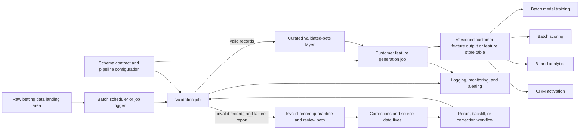

# Architecture Diagram

```mermaid
flowchart LR
  A[Raw betting data landing area] --> B[Batch scheduler or job trigger]
  B --> C[Validation job]
  M[Schema contract and pipeline configuration] --> C
  M --> F[Customer feature generation job]
  C -->|valid records| D[Curated validated-bets layer]
  C -->|invalid records and failure report| E[Invalid-record quarantine and review path]
  D --> F
  F --> G[Versioned customer feature output or feature store table]
  G --> H[Batch model training]
  G --> I[Batch scoring]
  G --> J[BI and analytics]
  G --> K[CRM activation]
  C --> L[Logging, monitoring, and alerting]
  F --> L
  E --> N[Corrections and source-data fixes]
  N --> O[Rerun, backfill, or correction workflow]
  O --> C
```
